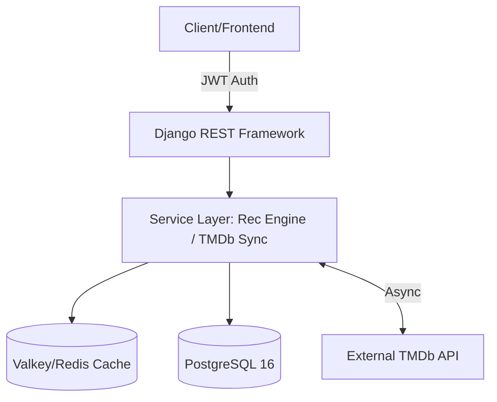

# Nexus Movie API

**A production-ready movie recommendation engine and social platform.**

**[🚀 Live Demo](https://nexus-movie-app.onrender.com)** · **[📖 Interactive Swagger Docs](https://nexus-movie-app.onrender.com/swagger/)** · **[📦 ReDoc](https://nexus-movie-app.onrender.com/redoc/)**

---

## 🏗 System Architecture

The project follows a **Service-Layer Pattern**, decoupling business logic from views to ensure high performance and testability.



---

## ✨ Key Features

### 🔐 Security & Authentication

* **JWT Implementation**: Stateless authentication via `SimpleJWT` with token rotation.
* **Throttling**: Tiered rate limiting (1000 requests/hr for authenticated users).
* **Permissions**: Strict owner-based access for ratings and playlists.

### 🧠 Recommendation Engine

* **Match-Score Algorithm**: Calculates a compatibility score (0-100) based on:
* **Genre Affinity (40%)**: Derived from user preference history.
* **Rating History (30%)**: Similarity to highly-rated titles.
* **Quality & Popularity (30%)**: Consensus metrics from TMDb.


### 🎬 Discovery & Social

* **TMDb Sync**: Automated data normalization and import of external movie metadata.
* **Social Playlists**: Create, manage, and share public or private movie collections.
* **Rating System**: 1-5 star ratings with unique constraints per user per movie.

---

## 📖 API Documentation

The API follows strict RESTful principles. Below is a subset of high-value endpoints.

### Discovery & Search

| Method | Endpoint | Description |
| --- | --- | --- |
| `GET` | `/api/movies/` | List movies with advanced search/filter. |
| `GET` | `/api/movies/trending/` | **(Cached)** Real-time global trending titles. |
| `GET` | `/api/movies/recommendations/` | **(Auth)** AI-generated personalized feed. |
| `GET` | `/api/tmdb/search/` | Live proxy search for global TMDb data. |

### Interaction & Profiles

| Method | Endpoint | Description |
| --- | --- | --- |
| `POST` | `/api/ratings/` | Submit star ratings and text reviews. |
| `GET` | `/api/profiles/stats/` | View personal viewing analytics. |
| `POST` | `/api/playlists/` | Curate custom movie collections. |

---

## 🛠 Technology Stack

* **Backend**: Django 5.1 & Django REST Framework 3.14.
* **Database**: PostgreSQL 16 (Hosted on Render).
* **Caching**: Valkey 8 (Redis-compatible) for search and trending data.
* **Infrastructure**: Hosted on Render with automated CI/CD.

---

## 🧪 Testing & Quality Assurance

The project maintains a rigorous test suite covering model constraints, API permissions, and the recommendation logic.

```bash
# Run all tests
python manage.py test

# 19 tests passing:
# - Model Constraints & Signals
# - JWT Auth & Rate Limiting
# - Recommendation Scoring Logic
# - TMDb Service Integration

```

---

## ⚙️ Development Setup

1. **Clone & Install**:
```bash
git clone https://github.com/BillyMwangiDev/alx-project-nexus.git
pip install -r requirements.txt

```


2. **Environment**: Create a `.env` file based on `.env.example` including your `TMDB_API_KEY`.
3. **Database Migration**:
```bash
python manage.py migrate
python manage.py sync_tmdb_movies --category popular --pages 5

```


4. **Run Server**:
```bash
python manage.py runserver

```


---

## 🔬 Engineering Decisions

* **JSONB for Genres**: We leverage PostgreSQL's JSONB to store genres, enabling high-speed array filtering without heavy junction table overhead.
* **Cache-Aside Pattern**: Redis (Valkey) caches TMDb responses for 24 hours to stay within rate limits and reduce latency.
* **Service Layer**: All TMDb logic is isolated in `services/tmdb_service.py` to keep views clean and reusable.

---

## 📄 License

This project is licensed under the MIT License.

**Developed by [Billy Mwangi**](https://github.com/BillyMwangiDev)

---

